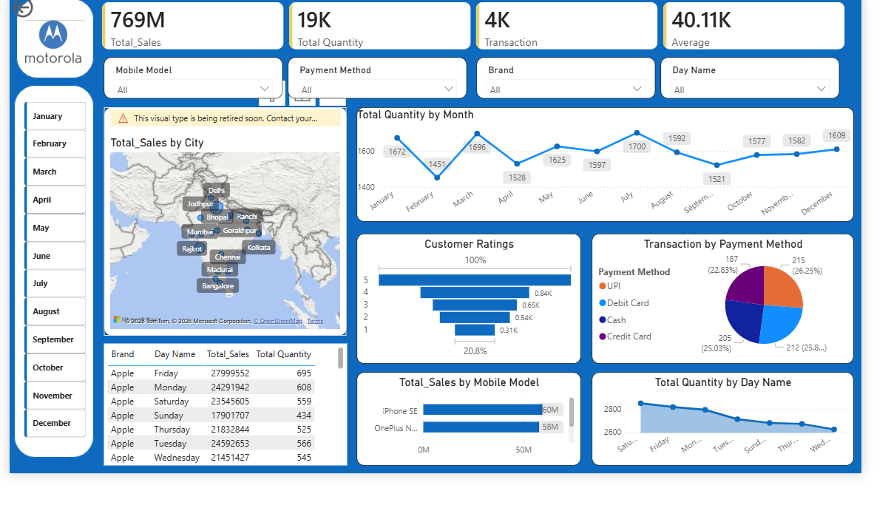

# 📊 Sales Analytics Dashboard

## 🔍 Overview
An interactive dashboard built to analyze sales performance, customer behavior, and payment trends.

## 🚀 Key Features
- Total Sales, Transactions, and Average Metrics
- Monthly Sales Trend Analysis
- Sales Distribution by City (Map)
- Customer Rating Insights
- Payment Method Analysis (UPI, Debit Card, Credit Card, Cash)
- Sales by Mobile Models
- Day-wise Sales Analysis

## 🛠️ Tools Used
- Power BI
- Excel

## 📁 Files Included
- Sales Dataset.xlsx
- Sales Dashboard.pbix
- dashboard-preview.png

## 📸 Dashboard Preview

## 🎥 Demo Video
(https://drive.google.com/file/d/1bdQYXJOalKXA7VvJpf4MJjs_rqCwH2Zb/view?usp=sharing)

## 📌 Insights
- Identified peak sales months
- Observed customer payment preferences
- Found top-performing cities and products

## 👩‍💻 Author
Payal Bhuria
